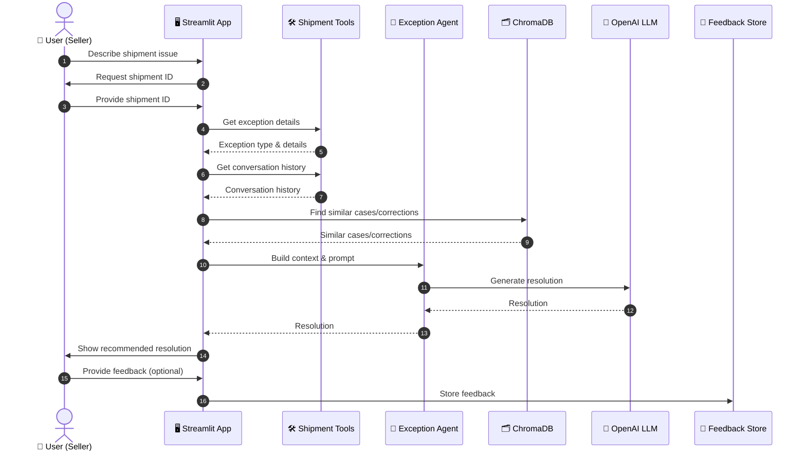

# ConversationalAgent: Automated Shipment Exception Resolution

This project automates the classification and resolution of shipment exceptions (e.g., address issues, failed deliveries) using shipment logs and seller-agent conversation history. It leverages AI agents, LangChain, and ChromaDB to recommend or autonomously resolve issues with minimal human intervention.

## Features
- Exception classification from logs and conversations
- Contextual retrieval using ChromaDB
- AI agent-driven action recommendation and resolution
- Simple Streamlit chatbot interface

## Setup
1. Install dependencies:
   ```bash
   pip install -r requirements.txt
   ```
2. Set your OpenAI API key as an environment variable:
   ```bash
   export OPENAI_API_KEY=your-key-here
   ```
3. Run the app:
   ```bash
   streamlit run app.py
   ```

## Directory Structure
```
ConversationalAgent/
├── data/
│   ├── shipment_logs.csv
│   └── conversations.json
├── agents/
│   └── exception_agent.py
├── tools/
│   └── shipment_tools.py
├── vectorstore/
│   └── chroma_db.py
├── app.py
├── requirements.txt
└── README.md
```

## 🚦 How It Works: Sequence Overview

Below is the step-by-step flow of how a shipment exception is resolved in this system:



---

flowchart TD
    subgraph UI
        A[👤 Seller]
        B[🖥️ Streamlit Web App]
    end
    subgraph Data
        C[📄 Shipment Logs & Conversations]
        H[📝 Feedback Store]
    end
    subgraph Intelligence
        D[🤖 Exception Agent]
        E[🛠️ Shipment Tools]
        F[🗂️ ChromaDB (Vector Store)]
        G[🧠 OpenAI LLM]
    end

    A --> B
    B --> C
    B --> H
    B --> D
    D --> E
    D --> F
    D --> G
    F -.-> D
    H -.-> B


---

### 💡 What Happens Under the Hood?
- **User** interacts with the chatbot UI to report an issue.
- **Streamlit App** orchestrates the flow, fetching shipment details and conversation history.
- **Exception Agent** builds a context-rich prompt, leveraging:
  - **Shipment Tools** for log and conversation access
  - **ChromaDB** for similar past cases and admin corrections
  - **OpenAI LLM** for generating a tailored, actionable resolution
- **Feedback** is collected and stored for continuous improvement.

> This architecture ensures fast, context-aware, and actionable resolutions for shipment exceptions, minimizing manual intervention and improving seller experience. 